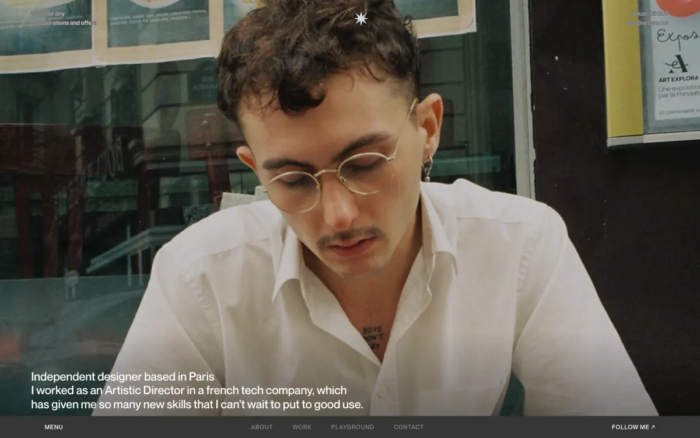

# Elouan Begue — Portfolio

Personal portfolio of Elouan Begue, independent Creative Director based in Paris.

Live: https://studioflower-fr.github.io/elouan-portfolio/



## What it does

- Home page with intro, bio and project highlights (`index.html`)
- Work index listing 8 client and school case studies (`work.html`)
- One dedicated case study page per project (`work-*.html`)
- Playground page for experimental pieces (`playground.html`)
- Contact page (`contact.html`) and a custom 404 page (`404.html`)
- Served live via GitHub Pages; also includes `_headers` / `_redirects` config for Netlify/Cloudflare Pages

## Tech stack

Static HTML, CSS and vanilla JavaScript — no framework, no build step, no dependencies.

## Run locally

Any static file server works, for example:

```bash
python3 -m http.server 8000
```

Then open `http://localhost:8000/index.html`.

## Case studies

- **Allowa** — real estate platform connecting owners to the best agents (UI/UX design)
- **Hausze** — digital media and magazine platform (entrepreneurship, editorial and web design)
- **Entropy** — dark urban brand exploring urban aesthetics and digital experiences
- **Tetu** — magazine editorial design, art direction and web design
- **Monkey Vape / MV KA** — branding, web design and visual identity
- **Dina Summer** — branding for a Berlin music artist (social media, posters, merch)
- **Norphe** — audio brand art direction, branding, web design and integration
- **Syno** — pharmaceutical branding school project (art direction, 3D renders, photography, editorial design)

## Context

Personal portfolio combining client work, brand concepts and a school project (Syno). Built and maintained by Elouan Begue.

## License

All rights reserved. See [LICENSE](LICENSE) — this repository's content (design, code and assets) is not open source.
